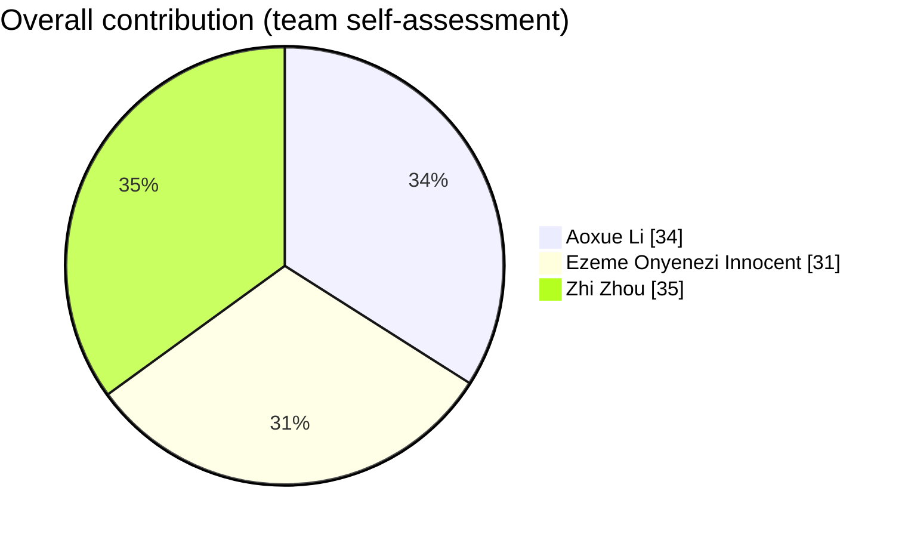

# 🎲 BGG Board Game Data Pipeline

> A University of Helsinki *Data Science* mini project — downloading, cleaning, analysing and serving board game data from **BoardGameGeek**.

[](https://boardgamegeek.com/xmlapi2)
[]()
[](https://boardgamegeek.com/wiki/page/XML_API_Terms_of_Use)

## At a Glance

| | |
|---|---|
| **Dataset** | 2,077 board games × 26 cleaned features |
| **Source** | Official BGG XML API2 — `thing`, `search`, `hot` endpoints |
| **Pipeline** | Download → Clean → EDA → ML (regression, classification, NLP, recommender) → Web app |
| **Web app** | 5 Streamlit pages — game finder, data explorer, "more like this", Bestiary quiz |

---

## 📂 Repository Structure

```
├── data/            # raw cache, cleaned datasets, EDA & ML charts, recommender CSVs
├── scripts/         # download, cleaning, EDA, regression, classification, NLP, recommender
├── webapp/          # Streamlit app modules & Bestiary artwork assets
├── report/          # final_report.pdf (technical report) + final_report.qmd (Quarto source)
├── canvas/          # project proposal canvas (DOCX + HTML)
└── .streamlit/      # app theme configuration
```

---

## 📁 Key Files

**Data & scripts**

| File | What it does |
|---|---|
| `scripts/fetch_bgg.py` | Hot list + 50 keyword searches → ~4,000 candidates → **2,077 core games** after filtering |
| `scripts/clean_bgg_data.py` | Dedup, normalise missing values, type conversion, feature engineering → `data/cleaned_games.csv` |
| `scripts/eda.py` | Full exploratory analysis — saves **14 publication-style charts** into `data/charts/` |
| `scripts/ml_part1_regression.py` | Popularity regression with TF-IDF/SVD description features + rating-MAE side analysis |
| `scripts/ml_part2_classification.py` | "Good game" (rating ≥ 7) classifier — ROC/PR curves, confusion matrix, feature importance |
| `scripts/ml_part2_discriminative_words.py` | TF-IDF word profiles that distinguish each major game category |
| `scripts/ml_part3_recommender.py` | Content-based game finder (fit score) + Jaccard "more like this" neighbours |

**Web app**

| File | What it does |
|---|---|
| `webapp/app.py` | Streamlit entry point — page config, styling, sidebar routing |
| `webapp/part1_find.py` | Home page + game finder |
| `webapp/part2_explore.py` | Interactive Plotly data explorer |
| `webapp/part3_more.py` | "More like this" page + Board Game Bestiary quiz |

**Datasets**

| File | Description |
|---|---|
| `data/games.csv` | Raw export from the downloader (uncleaned) |
| `data/cleaned_games.csv` | Cleaned analysis dataset — **2,077 × 26** |
| `data/recommendation_scores.csv` | Fit scores for all games (powers the game finder) |
| `data/similar_games.csv` | Top-5 similar games per game (powers "More like this") |

---

## 🚀 Quick Start

The pipeline has five steps: **download → clean → explore → model → web app**. Every step has a Windows `.bat` (double-click) and a macOS/Linux `.sh` launcher.

> 💡 The cleaned datasets are committed to the repo, so Steps 1–2 can be skipped if you only want to run analysis, models or the app.

### Step 1 — Download the data

> Get a free API token at [boardgamegeek.com/applications](https://boardgamegeek.com/applications).

**Windows (easiest):** double-click `run.bat`, paste your token when asked, wait ~20 min → `data/games.csv`.

<details>
<summary>Manual commands</summary>

```bat
:: Windows (Anaconda Prompt)
set BGG_API_TOKEN="your token"
python scripts\fetch_bgg.py --out data
```

```bash
# Mac / Linux
export BGG_API_TOKEN="your token"
python3 scripts/fetch_bgg.py --out data
```

</details>

> Raw XML responses are cached in `data/raw/`, so interrupted runs resume without re-downloading.

### Step 2 — Clean the data

**Windows (easiest):** double-click `clean.bat`.

<details>
<summary>Manual commands</summary>

```bat
:: Windows (Anaconda Prompt)
python scripts\clean_bgg_data.py
```

```bash
# Mac / Linux
bash clean.sh
# or directly:
python3 scripts/clean_bgg_data.py
```

</details>

Output → `data/cleaned_games.csv`

### Step 3 — Exploratory data analysis

**Windows (easiest):** double-click `eda.bat`.

<details>
<summary>Manual commands</summary>

```bat
:: Windows (Anaconda Prompt)
python scripts\eda.py
```

```bash
# Mac / Linux
bash eda.sh
# or directly:
python3 scripts/eda.py
```

</details>

Output → 14 PNG charts in `data/charts/`

### Step 4 — Machine learning

**Windows (easiest):** double-click `ml_parts.bat`.

<details>
<summary>Manual commands</summary>

```bat
:: Windows (Anaconda Prompt)
python scripts\ml_part1_regression.py
python scripts\ml_part2_classification.py
python scripts\ml_part3_recommender.py
python scripts\ml_part2_discriminative_words.py   REM optional NLP extra
```

```bash
# Mac / Linux
bash ml_parts.sh
# or run individually:
python3 scripts/ml_part1_regression.py
python3 scripts/ml_part2_classification.py
python3 scripts/ml_part3_recommender.py
python3 scripts/ml_part2_discriminative_words.py   # optional NLP extra
```

</details>

Output → model charts in `data/ml_charts/`, plus `data/recommendation_scores.csv` and `data/similar_games.csv`.

### Step 5 — Run the web app

**Windows (easiest):** double-click `run_webapp.bat`.

<details>
<summary>Manual commands</summary>

```bat
:: Windows (Anaconda Prompt)
streamlit run webapp\app.py
```

```bash
# Mac / Linux
bash run_webapp.sh
# or directly:
streamlit run webapp/app.py
```

</details>

Your browser opens [http://localhost:8501](http://localhost:8501). The app needs `data/cleaned_games.csv` and `data/similar_games.csv` (Steps 2 and 4).

### Dependencies

```bash
pip install -r requirements.txt
```

EDA and ML scripts additionally need:

```bash
pip install pandas numpy matplotlib scikit-learn scipy
```

---

## 📊 Analysis & Machine Learning

All models use a **cold-start feature set**: structured game attributes available before release + 30 TF-IDF → SVD components from the game description. Post-rating signals such as `users_rated` are excluded from the classifier to prevent leakage.

| Part | Question | Approach | Headline result |
|---|---|---|---|
| **EDA** | What does the dataset look like? | 14 charts: distributions, trends, tags, correlations | Rating correlates with complexity at $r \sim 0.50$ |
| **Part 1 — Regression** | What makes a game popular? | Linear, Ridge, RF, GB, MLP | Popularity (`log(users_rated)`) test $R^2 \sim 0.70$; raw rating $R^2 \sim 0.25$–$0.37$ with $MAE \sim 0.8$ |
| **Part 2 — Classification** | Is this a "good" game (rating ≥ 7)? | LogReg, RF, GB, MLP, class-weighted | Test $\text{AUC} \sim 0.85$ vs ~69% majority-class baseline |
| **Part 2 — Text** | What words characterise each category? | Per-category TF-IDF profiles | e.g. economic games: *market, auction, trade* |
| **Part 3 — Recommender** | What fits our game night? | Transparent fit score on players, play time, complexity, quality, popularity | Top-10 personalised lists |
| **Part 3 — Similar games** | More like this? | Jaccard similarity on categories + mechanics, same series excluded | Top-5 neighbours per game |

---

## 🖥️ Web App

The Streamlit app (`webapp/app.py`) has five pages:

1. **Home** — what the project is and where the data comes from
2. **Find me a game** — sliders for group size, available time and complexity taste return the ten best-fitting games
3. **Explore the data** — interactive Plotly charts with year/category/complexity filters, hover, zoom and search
4. **More like this** — pick any game to see its five closest neighbours
5. **Board Game Bestiary** — an eight-question parody quiz that assigns one of four player creatures, each linked to real games:
   - 🏗️ **Tung Tung Tung Tung Sahur — The City Builder** (economic, city building, civilization)
   - 🏖️ **Tralalero Tralala — The Beach Party Animal** (party, dexterity, word games)
   - 📜 **Luguanluguan — The Rule Sheriff** (abstract strategy, deduction)
   - 💣 **Bombardino Crocodillo — The Bombardier** (dice, wargame, fighting)

---

## 🗃️ Columns (`data/cleaned_games.csv`)

| Column | Description |
|---|---|
| `game_id` | BGG game id |
| `name` | Primary name |
| `year_published` | Release year (`NaN` = unknown) |
| `min_players` / `max_players` | Player count range |
| `playing_time_min` | Typical play time in minutes |
| `min_playtime` / `max_playtime` | Play time range |
| `min_age` | Recommended minimum age (`0` = no restriction) |
| `users_rated` | Number of ratings |
| `avg_rating` | Average user rating (1–10) |
| `bayes_rating` | Bayesian average (`NaN` = not enough ratings) |
| `complexity_weight` | Complexity 1 (easy) … 5 (heavy) |
| `board_game_rank` | Overall BGG rank (`NaN` = unranked) |
| `categories` | Semicolon-separated categories |
| `mechanics` | Semicolon-separated mechanics |
| `designers` | Semicolon-separated designers |
| `description` | Free-text description (great for NLP) |
| `description_length` | Number of characters in description |
| `decade` | Release decade, e.g. 2010 (`0` = unknown) |
| `complexity_group` | light / medium / heavy / unknown |
| `playtime_group` | short (≤30 min) / medium (31–90) / long (>90) / unknown |
| `is_solo` | `1` = playable solo |
| `rank_tier` | top1000 / top5000 / ranked / unranked |
| `n_categories` / `n_mechanics` | Number of categories / mechanics |

---

## 🧹 Data Cleaning Highlights

The raw export contains classic "dirty data" problems that the cleaning pipeline fixes:

- **Fake zeros** — BGG uses `0` as "no data" for year, playtime, ratings, complexity and `users_rated` (e.g. 402 games have `playing_time=0`, 197 have `avg_rating=0.0`). Converted to `NaN`.
- **Ancient games** — e.g. Go is stored with year **-2200** (2200 BC); treated as unknown year.
- **`"Not Ranked"`** — literal string for unranked games; normalised to `NaN`.
- **Duplicates & text numbers** — duplicate `game_id` rows are dropped; numeric columns stored as text are converted.
- **`min_age=0` is kept** — BGG uses it to mean "no age restriction".

---

## 👥 Team & Contributions

| Member | Programme | Owned deliverables |
|---|---|---|
| **Aoxue Li** | Life Science Informatics | `clean_bgg_data.py`, `ml_part1_regression.py`, `webapp/part1_find.py`; `.sh` launcher scripts; README & project documentation |
| **Ezeme Onyenezi Innocent** | Computer Science | `ml_part2_classification.py`, `ml_part2_discriminative_words.py`, `webapp/part2_explore.py`, `webapp/part3_more.py` |
| **Zhi Zhou** | Life Science Informatics | `ml_part3_recommender.py` (recommender + similar-games engine), `app.py`; `.bat` launcher scripts; deployment & environment configuration; README & project documentation |

> The data downloader, cleaning pipeline, EDA, Streamlit app shell, report and proposal were built and reviewed jointly by all three members.

### Task Division

| Work package | Aoxue | Ezeme | Zhi |
|---|:---:|:---:|:---:|
| Data collection (BGG API downloader & caching) | ◐ | **—** | **●** |
| Cleaning & feature engineering | **●** | **—** | ◐ |
| Exploratory data analysis (14 charts) | **—** | **●** | ◐ |
| Part 1 — popularity / rating regression | **●** | ◐ | ◐ |
| Part 2 — good-game classification | ◐ | **●** | ◐ |
| Part 2 — discriminative-words text analysis | ◐ | **●** | ◐ |
| Part 3 — recommender & similar games | ◐ | ◐ | **●** |
| Web app — Home & Find me a game | **●** | ◐ | ◐ |
| Web app — Explore the data | ◐ | **●** | ◐ |
| Web app — More like this & Bestiary | ◐ | **●** | ◐ |
| App shell, theme & integration | ◐ | ◐ | **●** |
| Batch/Shell launcher — `.sh` scripts (macOS/Linux) | **●** | ◐ | ◐ |
| Batch/Shell launcher — `.bat` scripts (Windows) | ◐ | ◐ | **●** |
| Deployment & environment configuration | ◐ | ◐ | ◐ |
| Report, Quarto source & proposal | ◐ | ◐ | ◐ |
| README & project documentation | **●** | **—** | **●** |

> **●** module owner / lead · **◐** joint work, testing and review · **—** not involved
>
> Two-owner packages (README & project documentation) are split 50/50 between the named owners.




---

## 🔒 Security Note

The BGG API token is **never** stored in this repo. Scripts read it from the environment or ask for it interactively, and `.gitignore` excludes any token-like files and the `raw/` cache.
